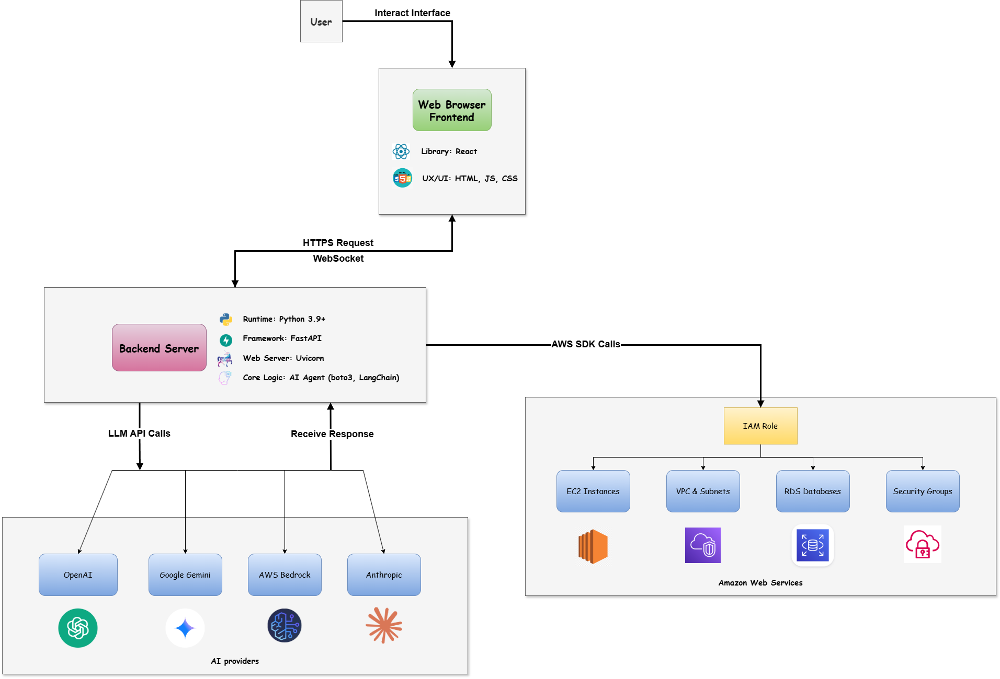

# InfraPilot AI for AWS

<p align="center">
  
</p>

<p align="center">
    <em>An autonomous AI Agent for managing and operating AWS infrastructure using natural language.</em>
</p>

<p align="center">
    <a href="#--key-features">Features</a> •
    <a href="#--architecture">Architecture</a> •
    <a href="#--getting-started">Getting Started</a> •
    <a href="#--usage">Usage</a> •
    <a href="#--configuration">Configuration</a> •
    <a href="#--contributing">Contributing</a>
</p>

---

**InfraPilot AI** is a groundbreaking system that allows you to interact with and manage your Amazon Web Services (AWS) resources using natural language commands. Instead of writing complex scripts or manually navigating the AWS Console, you simply instruct the AI Agent, and it will autonomously analyze, plan, and execute the required tasks.

This project aims to simplify cloud infrastructure management, reduce human error, and accelerate deployment workflows for DevOps professionals, system engineers, and developers.

## ✨ Key Features

- **Natural Language Interface**: Create virtual machines, configure networks, or check security settings with simple, conversational commands.
- **Intelligent Planning**: The AI autonomously analyzes user requests, compares them against the current infrastructure state, and generates an optimal multi-step execution plan.
- **Extensible Tool System**: Easily extendable with new "tools" to interact with a wide range of AWS services (EC2, VPC, S3, RDS, IAM, etc.).
- **State Management**: Maintains a record of the infrastructure's state, enabling the AI to make more accurate, context-aware decisions and prevent conflicts.
- **API-First Architecture**: The backend is built on FastAPI, ready for integration with custom user interfaces or other automation systems via REST API and WebSockets.
- **Multi-LLM Support**: Capable of connecting to various leading LLM providers, including OpenAI, Google Gemini, AWS Bedrock, and Anthropic.

## 🏗️ Architecture

InfraPilot AI is designed with a modular architecture, consisting of three main components:

1.  **Backend Server (Python/FastAPI)**:
    *   **API Layer**: Receives user requests via HTTP or WebSocket.
    *   **AI Agent Core**: The brain of the system, which uses an LLM to interpret requests, create plans, and select the appropriate tools.
    *   **Tool Factory & Adapters**: Provides a suite of tools for interacting with AWS APIs. Adapters abstract the underlying `boto3` calls.
    *   **State Manager**: Tracks and manages the state of the provisioned AWS resources.

2.  **AI Providers**: An integration layer for communicating with external Large Language Models (LLMs) to provide reasoning and planning capabilities.

3.  **Amazon Web Services (AWS)**: The target cloud environment where resources (EC2, VPC, Security Groups, etc.) are managed.

The diagram illustrates the workflow: A user sends a request to the backend. The AI Agent analyzes it, creates a plan, and executes it by invoking the corresponding AWS SDK (Boto3) functions.

## 🚀 Getting Started

Follow these steps to deploy and run the project locally.

### Prerequisites

- Python 3.9+
- [Poetry](https://python-poetry.org/docs/#installation) for dependency and environment management.
- [AWS CLI](https://aws.amazon.com/cli/) installed and configured with your credentials (via `aws configure` or environment variables).

### Installation

1.  **Clone the repository:**
    ```bash
    git clone https://your-repository-url/infrapilot-ai-aws.git
    cd infrapilot-ai-aws
    ```

2.  **Install dependencies:**
    Use Poetry to create a virtual environment and install all required packages.
    ```bash
    poetry install
    ```

3.  **Configure the environment:**
    Copy the example `.env.example` file to a new `.env` file.
    ```bash
    cp .env.example .env
    ```
    Open the `.env` file and provide the necessary values:
    - `AWS_REGION`: Your default AWS region (e.g., `us-east-1`).
    - `AWS_ACCESS_KEY_ID` & `AWS_SECRET_ACCESS_KEY`: Your AWS credentials (it's recommended to leave these blank if you have configured the AWS CLI or are using an IAM Role).
    - `OPENAI_API_KEY` (or another LLM provider's key): The API key for the AI Agent to communicate with the language model.

### Running the Application

Use Poetry to launch the FastAPI server with Uvicorn.
```bash
poetry run uvicorn ai_infra_agent.main:app --reload --host 0.0.0.0 --port 8080
```
The server will start and become available at `http://localhost:8080`.

## 💡 Usage

You can interact with the AI Agent through the provided API endpoint.

**Endpoint**: `POST /api/v1/agent/execute`

**Body (JSON)**:
```json
{
  "request": "Your natural language request here"
}
```

**Example with `curl`:**

Send a request to create an EC2 instance:
```bash
curl -X POST "http://localhost:8080/api/v1/agent/execute" \
     -H "Content-Type: application/json" \
     -d \
'{ 
  "request": "Create a t2.micro EC2 instance using the latest Amazon Linux 2023 AMI in the default VPC. Name it `my-test-server`."
}'
```

The system will process this request. You can monitor the server console logs to see the generated plan and execution results.

## ⚙️ Configuration

The system's behavior can be customized through various configuration files:

- **`config.yaml`**: The main configuration file for adjusting agent, logging, and server parameters. Environment variables in the `.env` file will override values set here.
- **`settings/`**: This directory contains advanced configurations for the AI Agent:
    - `templates/decision-plan-prompt-optimized.txt`: The core prompt template used to instruct the LLM on how to analyze requests and create plans. This is where you can "teach" the AI how to behave.
   

## 🤝 Contributing

Contributions are welcome to make this project even better! Please feel free to create a Pull Request or open an Issue if you have ideas for improvements, bug fixes, or new tools.

1.  Fork the repository.
2.  Create a new branch (`git checkout -b feature/your-feature-name`).
3.  Make your changes.
4.  Commit your changes (`git commit -m 'Add some feature'`).
5.  Push to the branch (`git push origin feature/your-feature-name`).
6.  Open a Pull Request.

## 📄 License

This project is licensed under the MIT License. See the `LICENSE` file for more details.
