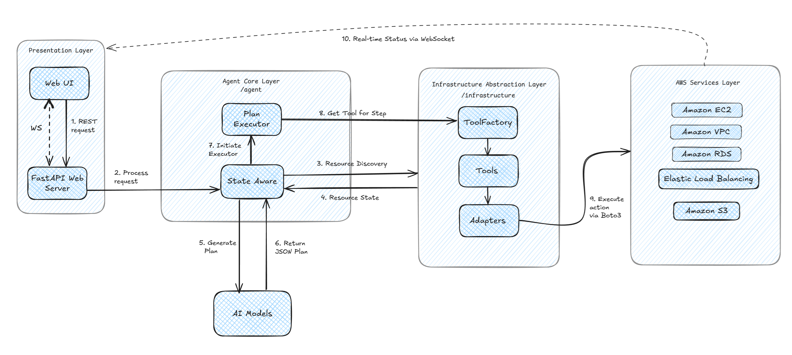

# Giải thích chi tiết hoạt động của Backend trong dự án InfraPilot AI

Dưới đây là bản phân tích chi tiết về cách hoạt động của hệ thống backend trong dự án InfraPilot AI.

## 1. Kiến trúc tổng quan

Backend của InfraPilot AI được xây dựng dựa trên một kiến trúc module hóa, bao gồm các thành phần chính sau:

- **FastAPI Application (`main.py`):** Là cổng vào của toàn bộ hệ thống. Nó xử lý các yêu cầu HTTP và WebSocket từ client.
- **AI Agent (`agent.py`):** Là "bộ não" của hệ thống. Nó nhận yêu cầu từ người dùng, tương tác với mô hình ngôn ngữ lớn (LLM) để tạo ra một kế hoạch thực thi, và sau đó thực thi kế hoạch đó.
- **Prompt Builder (`prompt_builder.py`):** Chịu trách nhiệm xây dựng các câu lệnh (prompt) chi tiết để gửi đến LLM, bao gồm thông tin về trạng thái hiện tại của hạ tầng, các công cụ có sẵn, và yêu cầu của người dùng.
- **State Manager (`manager.py`):** Quản lý và duy trì trạng thái của hạ tầng AWS. Nó lưu trữ thông tin về các tài nguyên đã được phát hiện hoặc tạo ra.
- **Tool Factory & Adapters (`tool_factory.py`, `adapters/`):** Cung cấp một bộ "công cụ" (tools) để AI Agent có thể tương tác với các dịch vụ của AWS. Các `Adapters` đóng vai trò là lớp trừu tượng, bao bọc các lệnh gọi đến AWS SDK (Boto3).
- **Plan Executor (`plan_executor.py`):** Chịu trách nhiệm thực thi tuần tự các bước trong kế hoạch do AI Agent tạo ra và gửi cập nhật trạng thái theo thời gian thực cho client qua WebSocket.

**Sơ đồ luồng hoạt động cấp cao:**

```
Client --> FastAPI --> AI Agent --> LLM (lên kế hoạch) --> Plan Executor --> Tools --> AWS
  ^            |             ^                                      |
  |            |             | (trạng thái hạ tầng)                  | (cập nhật qua WebSocket)
  |            +-------------+--------------------------------------+
  | (cập nhật)               |
  +--------------------------+
```

## 2. Luồng hoạt động chi tiết: Từ yêu cầu đến thực thi

Hãy cùng theo dõi một yêu cầu của người dùng từ đầu đến cuối:


### Bước 1: Client gửi yêu cầu

Người dùng nhập một yêu cầu bằng ngôn ngữ tự nhiên vào giao diện chat (ứng dụng `web`), ví dụ: "Tạo một EC2 instance loại t3.micro".

Giao diện người dùng sẽ gửi yêu cầu này đến backend. Có hai giai đoạn chính:

1.  **Lấy kế hoạch (HTTP POST):** Giao diện gửi yêu cầu đến endpoint `POST /api/v1/agent/process`.
2.  **Thực thi kế hoạch (WebSocket):** Sau khi nhận được kế hoạch, giao diện mở một kết nối WebSocket đến `/ws/v1/agent/execute` và gửi kế hoạch để bắt đầu thực thi.

### Bước 2: API Layer nhận yêu cầu (`agent_router.py`)

- Endpoint `POST /api/v1/agent/process` trong `agent_router.py` nhận yêu cầu.
- Nó trích xuất yêu cầu của người dùng từ body của request.
- Nó gọi phương thức `agent.process_request(user_request)`.

### Bước 3: Agent xử lý yêu cầu (`agent.py`)

Phương thức `process_request` trong lớp `StateAwareAgent` thực hiện các công việc sau:

1.  **Quét hạ tầng:** Nó gọi `scanner.scan_aws_resources()` để tự động phát hiện trạng thái mới nhất của các tài nguyên trên AWS. Trạng thái này được cập nhật vào `StateManager`.
2.  **Thu thập ngữ cảnh:**
    - Lấy trạng thái hạ tầng đã được định dạng từ `StateManager` (`get_current_state_formatted`).
    - Lấy định nghĩa về các công cụ có sẵn từ `PromptBuilder`.
3.  **Xây dựng Prompt (`prompt_builder.py`):**
    - `PromptBuilder` kết hợp yêu cầu của người dùng, trạng thái hạ tầng, và danh sách các công cụ vào một câu lệnh (prompt) lớn và chi tiết.
    - Prompt này được thiết kế để hướng dẫn LLM cách phân tích yêu cầu và tạo ra một kế hoạch dưới dạng JSON.
4.  **Tương tác với LLM:**
    - Agent gửi prompt đã xây dựng đến LLM đã được cấu hình (ví dụ: Gemini, OpenAI).
    - Agent nhận về một chuỗi JSON từ LLM. Chuỗi này là một kế hoạch thực thi, ví dụ:
      ```json
      {
        "executionPlan": [
          {
            "id": "step-1",
            "name": "Get Latest Amazon Linux AMI",
            "mcpTool": "get-latest-amazon-linux-ami",
            "toolParameters": {}
          },
          {
            "id": "step-2",
            "name": "Create EC2 Instance",
            "mcpTool": "create-ec2-instance",
            "toolParameters": {
              "image_id": "{{step-1.ImageId}}",
              "instance_type": "t2.micro"
            }
          }
        ]
      }
      ```
5.  **Trả về kế hoạch:** Agent trả về kế hoạch JSON này cho API layer, và API layer trả về cho client.

### Bước 4: Client thực thi kế hoạch qua WebSocket (`main.py` và `plan_executor.py`)

1.  **Kết nối WebSocket:** Client nhận được kế hoạch và ngay lập tức mở một kết nối WebSocket đến `/ws/v1/agent/execute`.
2.  **Gửi kế hoạch:** Client gửi toàn bộ kế hoạch JSON qua WebSocket.
3.  **`PlanExecutor` bắt đầu:**
    - Endpoint WebSocket trong `main.py` nhận kế hoạch và khởi tạo một đối tượng `PlanExecutor`.
    - `PlanExecutor` bắt đầu thực thi từng bước trong `executionPlan`.
4.  **Thực thi từng bước:**
    - Với mỗi bước, `PlanExecutor` đọc `mcpTool` và `toolParameters`.
    - **Giải quyết tham chiếu:** Nó tìm các giá trị tham chiếu như `{{step-1.ImageId}}`. Nó sẽ tìm trong "context" (một dictionary lưu kết quả của các bước trước) để lấy `ImageId` từ kết quả của `step-1`.
    - **Gọi Tool:** Sau khi đã có đủ tham số, nó gọi `agent.execute_tool(tool_name, **params)`.
    - **`agent.execute_tool`:**
        - Agent sử dụng `ToolFactory` để lấy đúng đối tượng `tool` (ví dụ: `CreateEC2InstanceTool`).
        - Nó gọi phương thức `execute()` của tool đó.
    - **Tool thực thi:**
        - Tool (ví dụ: `CreateEC2InstanceTool`) gọi phương thức tương ứng trong `Adapter` (ví dụ: `ec2_adapter.create_instance`).
        - `Adapter` thực hiện lệnh gọi đến AWS SDK (Boto3) với các tham số đã được xử lý.
        - Kết quả từ AWS được trả ngược lại qua các lớp.
5.  **Cập nhật Context và State:**
    - Kết quả của mỗi bước được lưu vào context của `PlanExecutor` để các bước sau có thể sử dụng.
    - Nếu một tài nguyên được tạo, `PlanExecutor` sẽ cập nhật `StateManager` với thông tin về tài nguyên mới.
6.  **Gửi cập nhật cho Client:**
    - Sau mỗi bước (thành công hay thất bại), `PlanExecutor` gửi một thông điệp JSON qua WebSocket để cập nhật giao diện người dùng theo thời gian thực. Ví dụ: `{"status": "Step Completed", "step": "Create EC2 Instance", "result": ...}`.
7.  **Kết thúc:** Khi tất cả các bước hoàn thành, `PlanExecutor` gửi một thông điệp hoàn tất và đóng kết nối WebSocket.

## 3. Phân tích sâu các thành phần cốt lõi

### FastAPI Application (`main.py`, `agent_router.py`)

- **`main.py`:**
    - Khởi tạo ứng dụng FastAPI.
    - Cấu hình CORS để cho phép frontend giao tiếp.
    - Định nghĩa endpoint WebSocket `/ws/v1/agent/execute` là nơi xử lý việc thực thi kế hoạch.
    - Bao gồm `agent_router` để quản lý các endpoint HTTP RESTful.
- **`agent_router.py`:**
    - Định nghĩa các endpoint RESTful:
        - `POST /process`: Nhận yêu cầu ngôn ngữ tự nhiên và trả về một kế hoạch.
        - `POST /discover`: Kích hoạt việc quét tài nguyên trên AWS.
        - `GET /state`: Lấy trạng thái hiện tại của hạ tầng.
    - Sử dụng hệ thống Dependency Injection của FastAPI (`Depends(get_agent)`) để đảm bảo các thành phần cốt lõi như `Agent`, `StateManager` được khởi tạo một lần và tái sử dụng trong các request.

### The Agent (`agent.py`)

- **`StateAwareAgent`:**
    - **`__init__`:** Khởi tạo LLM dựa trên `config.yaml`. Nó có thể là `ChatGoogleGenerativeAI`, `ChatOpenAI`, v.v.
    - **`process_request`:** Là phương thức chính điều phối việc tạo kế hoạch. Nó không thực thi bất cứ điều gì, chỉ tạo ra kế hoạch.
    - **`execute_tool`:** Là phương thức được `PlanExecutor` gọi để thực thi một công cụ cụ thể. Nó hoạt động như một cầu nối giữa `PlanExecutor` và `ToolFactory`.

### Prompt Engineering (`prompt_builder.py`)

- **`PromptBuilder`:**
    - **`__init__`:** Tải template chính của prompt từ file `decision-plan-prompt-optimized.txt`. Nó cũng tải các file YAML chứa các "patterns" và "mappings" để giúp LLM hiểu rõ hơn về các tài nguyên.
    - **`build`:** Đây là nơi "phép màu" xảy ra. Nó lấy template, và điền vào đó các thông tin:
        - `{request}`: Yêu cầu của người dùng.
        - `{state}`: Trạng thái hạ tầng từ `StateManager`.
        - `{tools}`: Một chuỗi JSON mô tả tất cả các công cụ có sẵn, được lấy từ `ToolFactory`.
    - Mục tiêu là tạo ra một prompt cực kỳ chi tiết để LLM có thể hoạt động như một chuyên gia AWS và chỉ cần trả về một kế hoạch JSON hợp lệ.

### State Management (`manager.py`)

- **`StateManager`:**
    - Giữ trạng thái của hạ tầng trong bộ nhớ (`self.state`).
    - **`set_discovered_state`:** Được gọi bởi agent sau khi quét AWS để cập nhật trạng thái.
    - **`add_resource`:** Được gọi bởi `PlanExecutor` sau khi một tài nguyên được tạo thành công.
    - **`get_current_state_formatted`:** Định dạng lại dữ liệu trạng thái thành một chuỗi văn bản dễ đọc để đưa vào prompt cho LLM.

### Tool System (`tool_factory.py`, `tools/`, `adapters/`)

Đây là một ví dụ điển hình của **Adapter Pattern** và **Factory Pattern**.

- **Adapters (ví dụ: `ec2.py`):**
    - Mỗi adapter tương ứng với một dịch vụ của AWS (EC2, VPC, S3...).
    - Nó chứa các phương thức bao bọc các lệnh gọi Boto3. Ví dụ, `EC2Adapter.create_instance` sẽ gọi `boto3.client('ec2').run_instances(...)`.
    - Mục đích là để tách biệt logic nghiệp vụ (trong Tools) khỏi logic giao tiếp trực tiếp với AWS SDK.
- **Tools (ví dụ: `tools/ec2.py`):**
    - Mỗi tool đại diện cho một hành động cụ thể mà AI có thể thực hiện (ví dụ: `CreateEC2InstanceTool`).
    - Mỗi tool có một `name` và `description` để LLM có thể hiểu và chọn đúng tool.
    - Phương thức `execute()` của tool sẽ nhận các tham số, thực hiện một số logic nếu cần, và sau đó gọi phương thức tương ứng trong Adapter.
- **`ToolFactory`:**
    - **`__init__` và `_register_all_tools`:** Khởi tạo tất cả các Adapters và sau đó khởi tạo tất cả các Tools, "tiêm" các adapter cần thiết vào chúng. Nó đăng ký tất cả các tool vào một dictionary `self._tools`.
    - **`create_tool(tool_name)`:** Hoạt động giống như một "getter", trả về một instance của tool đã được đăng ký.
    - **`get_all_tool_info`:** Lấy `name` và `description` của tất cả các tool để `PromptBuilder` có thể đưa vào prompt.

### Plan Execution (`plan_executor.py`)

- **`PlanExecutor`:**
    - **`execute_plan`:** Vòng lặp chính để xử lý từng bước trong kế hoạch.
    - **`_resolve_placeholders_recursively`:** Một trong những phần quan trọng nhất. Nó sử dụng regex để tìm các chuỗi như `{{step-id.key}}` và thay thế chúng bằng giá trị thực từ kết quả của các bước trước đó. Điều này cho phép tạo ra các chuỗi hành động phụ thuộc lẫn nhau (ví dụ: tạo VPC trước, sau đó dùng ID của VPC đó để tạo subnet).
    - **`_send_update`:** Gửi thông điệp trạng thái về cho client qua WebSocket.
    - **`_update_state_after_creation`:** Gọi `StateManager` để lưu lại thông tin về tài nguyên mới.

## 4. Cấu hình (`config.yaml`)

- **`config.yaml`:** Là file cấu hình trung tâm.
    - **`agent`:** Cho phép thay đổi LLM provider (`gemini`, `openai`), model, (temperature),...
    - **`logging`:** Cấu hình mức độ log (debug, info, error).
    - **`state`:** Cấu hình đường dẫn đến file lưu trạng thái.
    - Các cài đặt này được đọc bởi một đối tượng `settings` (sử dụng Pydantic) và được cung cấp cho toàn bộ ứng dụng, đảm bảo tính nhất quán.
